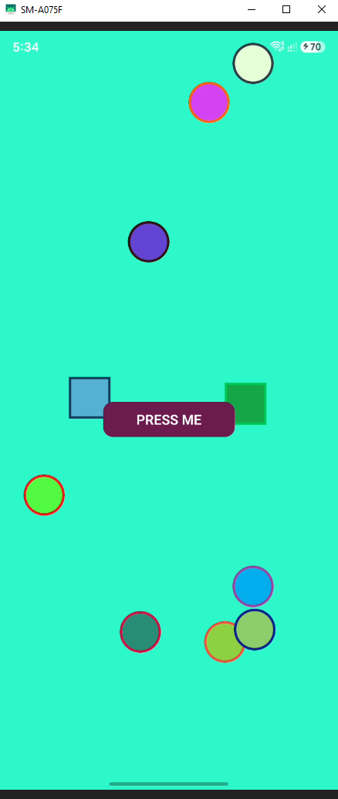
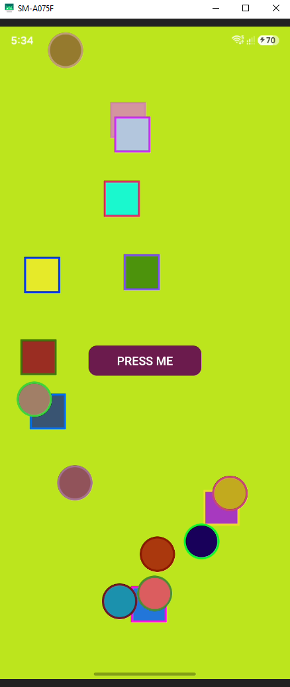
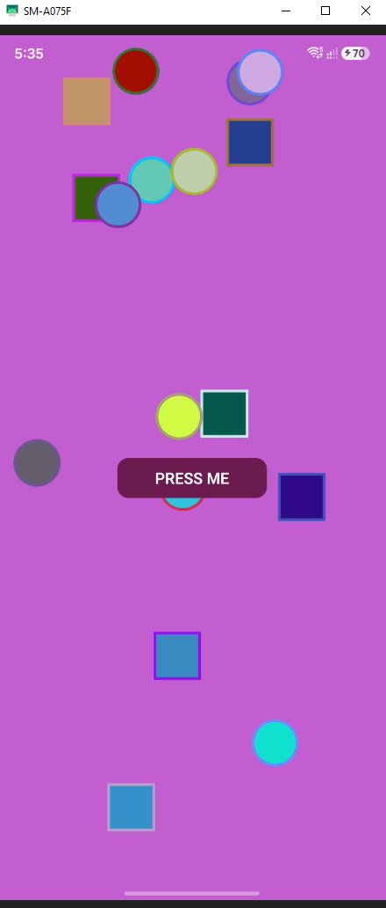

# 🎨 BgChanger - React Native App

A sleek, dynamic, and interactive React Native application that changes screen background colors and randomly spawns dynamic geometric shapes (squares and circles) with random positioning and custom border styling upon every button interaction.

Developed as part of a **Mobile App Development & React Native Learning Series**.

---

## 📱 App Screenshots / Demo Preview

| Preview 1 | Preview 2 | Preview 3 |
| :---: | :---: | :---: |
|  |  |  |

---

## ✨ Key Features

- 🎲 **Dynamic HEX Color Generator**: Generates clean, random 6-digit HEX color codes for screen backgrounds on every click.
- 📐 **Random Geometric Shapes**: Automatically calculates and renders a random count (1–10) of both square boxes and circular shapes.
- 📍 **Screen-Aware Placement**: Dynamically calculates screen dimensions using React Native `Dimensions` API to keep shapes within visible screen boundaries.
- 🎨 **Unique Styling per Shape**: Each spawned shape receives its own randomized background color and contrasting border color.
- ⚡ **Lightweight & High Performance**: Built with pure React Native state management and TypeScript for fast state transitions and type safety.
- 📱 **Safe Area & Theme Integration**: Fully compatible with iOS/Android safe area insets and status bar color updates.

---

## 🛠️ Tech Stack & Tools

- **Framework**: [React Native](https://reactnative.dev/) (v0.87.1)
- **Language**: [TypeScript](https://www.typescriptlang.org/)
- **UI Components**: React Native Core (`View`, `Text`, `TouchableOpacity`, `Dimensions`, `StatusBar`), `react-native-safe-area-context`
- **Build Tools**: Metro Bundler, Babel, ESLint, Prettier

---

## 🚀 Getting Started

Follow these instructions to set up and run the application on your local machine or emulator.

### Prerequisites

Ensure you have your React Native development environment configured:
- **Node.js**: `>= 22.11.0`
- **npm** or **yarn**
- **Android Studio** (for Android Emulator / physical device) or **Xcode** (macOS only, for iOS Simulator)

### Installation

1. **Clone the Repository**
   ```bash
   git clone https://github.com/imtiazaly/BgChanger-App-React-Native.git
   cd BgChanger-App-React-Native
   ```

2. **Install Dependencies**
   ```bash
   npm install
   ```

3. **Start Metro Bundler**
   ```bash
   npm start
   ```

4. **Run the App**
   - **Android**:
     ```bash
     npm run android
     ```
   - **iOS**:
     ```bash
     cd ios && pod install && cd ..
     npm run ios
     ```

---

## 🧠 Logic & Architecture Highlights

### 1. HEX Color Generation
Uses standard HEX character set (`0123456789ABCDEF`) to produce random color strings:
```typescript
const generateRandomColor = () => {
  const hexRange = '0123456789ABCDEF';
  let color = '#';
  for (let i = 0; i < 6; i++) {
    color += hexRange[Math.floor(Math.random() * 16)];
  }
  return color;
};
```

### 2. Screen-Aware Shape Positioning
Calculates valid X and Y coordinates based on `SCREEN_WIDTH` and `SCREEN_HEIGHT` minus shape dimensions offset to keep elements visible:
```typescript
const generateRandomPosition = () => {
  const shapeSize = 100;
  const x = Math.floor(Math.random() * (SCREEN_WIDTH - shapeSize));
  const y = Math.floor(Math.random() * (SCREEN_HEIGHT - shapeSize));
  return { x, y };
};
```

---

## 📂 Project Structure

```text
BgChanger-App-React-Native/
├── assets/                  # App preview screenshots (bg1.PNG, bg2.PNG, bg3.PNG)
├── App.tsx                  # Core app logic & UI layout
├── index.js                 # App entry point
├── package.json             # Project dependencies and scripts
├── tsconfig.json            # TypeScript configuration
└── README.md                # Project documentation
```

---

## 👨‍💻 Learning Objectives

This project was built to explore and master essential React Native concepts:
- Managing complex React state (`useState`) with TypeScript object arrays.
- Screen dimension calculation and absolute positioning in React Native.
- Touch handlers (`TouchableOpacity`) and dynamic inline styling.
- GitHub portfolio structure and documentation best practices.

---

## 📄 License

This project is open-source and available under the [MIT License](LICENSE).
